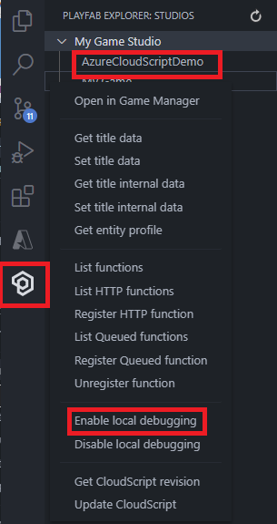

# Playfab Azure Functions App with Unity Game Demo
This document acts as a guide on how this app was constructed and covers some critical concepts necessary to follow to integrate your Azure Functions with PlayFab.

## Pre-requirements
Before we proceed, you must have the following:

1. An active  [Azure subscription]("https://docs.microsoft.com/en-us/azure/guides/developer/azure-developer-guide#understanding-accounts-subscriptions-and-billing"). If you don't have an [Azure subscription]("https://docs.microsoft.com/en-us/azure/guides/developer/azure-developer-guide#understanding-accounts-subscriptions-and-billing"), create a [free account]("https://azure.microsoft.com/free/?ref=microsoft.com&utm_source=microsoft.com&utm_medium=docs&utm_campaign=visualstudio").
2. Playfab Account. If you don't have an [Playfab Account](https://developer.playfab.com/en-US/login), create a [free account](https://developer.playfab.com/en-us/sign-up).
3. Playfab Title has been created, More instructions on how to do this can be found [here](https://docs.microsoft.com/en-us/gaming/playfab/gamemanager/pfab-account).

To get this Azure Functions app running you will need the following:
* [.NET Core 2+](https://dotnet.microsoft.com/download)
* [Azure Functions Core Tools](https://docs.microsoft.com/en-us/azure/azure-functions/functions-run-local#windows-npm)
* IDE ([VS Code](https://code.visualstudio.com/) recommended)

### Required Extensions
On [VS Code](https://code.visualstudio.com/) IDE, click on the `Extensions` button on the left bar or hit `Ctrl+Shift+X`. Search for and install or update the following extensions:
1. [C#](https://marketplace.visualstudio.com/items?itemName=ms-vscode.csharp)
2. [Nuget Package Manager](https://marketplace.visualstudio.com/items?itemName=jmrog.vscode-nuget-package-manager)
3. [Azure Functions](https://marketplace.visualstudio.com/items?itemName=ms-azuretools.vscode-azurefunctions)
4. [Playfab Explorer](https://marketplace.visualstudio.com/items?itemName=PlayFab.playfab-explorer)

### Adding Azure Functions Extension
You can use the Azure Functions extension to create and test functions and deploy them to Azure.


After installation, select the Azure icon on the Activity bar. You should see an Azure Functions area in the Side Bar.


#### Create an Azure Functions project
The Functions extension lets you create a function app project, along with your first function. The following steps show how to create a new Functions project.

1. From Azure Functions, select the Create Function Project icon:

    

2. Select the folder for your function app project.

    

3. Select a language for your function project.

    
    
4. Select the .Net Runtime Version for your function project (Always select the latest verison).

    
    
5. Select the HTTP trigger function template, or you can select Skip for now to create a project without a function. You can always [add a function to your project](https://docs.microsoft.com/en-us/azure/azure-functions/functions-develop-vs-code?tabs=csharp#add-a-function-to-your-project) later.

    

6. Generated project files

    The project template creates a project in your chosen language and installs required dependencies. For any language, the new project has these files:

    * [host.json](https://docs.microsoft.com/en-us/azure/azure-functions/functions-host-json): Lets you configure the Functions host. These settings apply when you're running functions locally and when you're running them in Azure. For more information, see host.json reference.

    * [local.settings.json](https://docs.microsoft.com/en-us/azure/azure-functions/functions-run-local#local-settings-file): Maintains settings used when you're running functions locally. These settings are used only when you're running functions locally. For more information, see Local settings file.

    * .vscode: Folder containing the run configuration(s)
    * .csproj: Corresponding to your project


:warning: **Because the local.settings.json file can contain secrets, you need to exclude it from your project source control**.

7. Playfab configuraiton

    Add the following settings to your local.settings.json file:
    | Name | Value |
    | --- | --- |
    | PLAYFAB_TITLE_ID | Your title ID, in hex form |
    | PLAYFAB_DEV_SECRET_KEY | Secret key for your title. You can find your secret keys in Game Manager by clicking on the gear icon to the right of your title's name and going to Title Settings > Secret Keys. |
	
	For example:
    ```json
    {
    "IsEncrypted": false,
    "Values": {
        "AzureWebJobsStorage": "...",
        "FUNCTIONS_WORKER_RUNTIME": "dotnet",
        "PLAYFAB_TITLE_ID": "[TITLE_ID]",
        "PLAYFAB_DEV_SECRET_KEY": "[SECRET_KEY]"
    }
    }
    ```
    
    :warning: **It is important to assign your PlayFab Developer Secret Key and Title ID on these settings or else the Functions in this app will not work.**

#### Create an Azure Functions
The Functions extension lets you create a function. The following steps show how to create an HTTP-triggered function in a new Functions project. HTTP trigger is the simplest function trigger template to demonstrate.

1. From Azure Functions, select the Create Function icon:

    

2. Select the HTTP trigger template option

    

3. Type <FUNCTION_NAME> for the function name and select Enter, and then Type <NAMESPACE_NAME> for the function namespace and select Enter

    
    

4. Select Function authorization. This authorization level requires you to provide a function key when you call the function endpoint.

    

5. A function is created in your chosen language and in the template for an HTTP-triggered function.

    

    If a pop-up appear on your screen stating that there are unresolved dependencies. Click Restore.

At this point, you can add input and output bindings to your function. You can also add a new function to your project.


### Adding NuGet Package Dependencies
1. Open the command palette (`Ctrl+Shift+P`) and type in "NuGet" and select `NuGet Package Manager: Add Package`.


2. Search for "PlayFab", select `PlayFabAllSDK`, and add the latest version.
3. Similarly, search for "PlayFab", select `PlayFabCloudScriptPlugin`, and add the latest version.
4. A pop-up should appear on your screen stating that there are unresolved dependencies. Click `Restore`.


This will pull and download the packages you just added to your project.

### Adding Playfab Extension
This extension provides a single PlayFab sign-in experience and tree view for all other PlayFab extensions, as well as some base functionality around titles and CloudScript.


After installation, select the Playfab icon on the Activity bar. You should see an Playfab area in the Side Bar.


### Local debugging for Cloudscript using Azure Functions
There are certain steps that we will cover here exclusively for VS Code.

#### For C# Azure Functions apps
To get the local implementation of ExecuteFunction set up in your C# Azure Functions app, add the [ExecuteFunction.cs](https://github.com/PlayFab/pf-af-devfuncs/blob/master/csharp/ExecuteFunction.cs) file to your local Azure Functions app. In this case it would be `/Functions`.
* You should not make modifications to this Azure Function.
* You should not deploy this Azure Function to your app on Azure, it's only useful when run locally.
* It is adviced to not check-in this Azure Function to a VCS.
* This function is called by your game client's PlayFab SDK code when local debugging is "enabled" on it.
* It acts as a local mock of the PlayFab server for executing Azure Functions locally by creating the same payload PlayFab would send to an Azure Function in the remote case.
* In short, your game client's SDK will send the execution request to this function, which then creates the appropriate payload to send to your Azure Function.


#### Configure PlayFab SDK to call local ExecuteFunction implementation
To tell the PlayFab SDK to redirect ExecuteFunction API calls to your local implementation, you follow either of the following:

* Using local file, Add a file called playfab.local.settings.json to one of two places:

    * The temporary directory on your machine
        * On Windows, this is the TEMP environment variable
        * On Linux/Mac, this is the TMPDIR environment variable
    * The directory of your game executable. (**Game client root directory**)
        * Set the content of the file as follows:
        ```Json
        { "LocalApiServer": "http://localhost:7071/api/" }
        ```
    * The value of `LocalApiServer` must match the URL your function app is being hosted on. By default, the Azure Functions run-time sets this to `http://localhost:7071/api/`. However, it will not explicitly specify it in `host.json` which is why the next step is crucial to local-debugging.
    * Edit the `host.json` file to look like the following:
        ```
        {
            "version": "2.0",
            "extensions": {
                "http": {
                    "routePrefix": "api"
                }
            }
        }
        ```
        If you wish to have something other than `api` as your route prefix, you must update `playfab.local.settings.json` to account for it. **It is important that you end the `LocalApiServer` string with a forward slash `/`**.
    * Unless absolutely necessary we suggest taking the default values of both the `routePrefix` and `port` ([how to change the port](https://docs.microsoft.com/en-us/azure/azure-functions/functions-run-local#local-settings-file)).

        (Note that the above steps will be done automatically through the PlayFab VS Code extension once it is released)

        When you would like to stop local redirects and make ExecuteFunction call the PlayFab API server, simply delete the playfab.local.settings.json file.
* Using playfab Extension, Choose the Playfab Title, right click and select the Enable local debugging option.

    

    When you would like to stop local redirects and make ExecuteFunction call the PlayFab API server, simply select the Disable local debugging option.

#### Here are some highlights for local debugging the Cloudscript using Azure Functions.

* Make sure that your Azure Functions Core Tools are installed
* Configure your local settings file.
* Set a break point in your code
* Select F5 to start debugging

Once the application has finished loading and is ready to be tested, a message like this will be displayed:


At this point, we can try different tests with the URL path that is shown. Every time that we make a call to this function, the request will be processed by this console.

:warning: **Note: So far we have neither published to Azure Functions not registered these functions to Playfab Functions**.


### Build and deploy

You can now perform a build by pressing `Ctrl+Shift+B` or entering `dotnet clean` followed by a `dotnet-build` in the terminal.

#### Setup on Azure Function

The Functions App is now ready to be run locally (`F5`) or deployed to Azure from the VS Code extension. To deploy, follow these steps:
1. Go to the Azure Functions Extension (`Ctrl+Shift+A`)
2. Find the Functions App you created on the [Azure Portal](https://portal.azure.com) earlier.


3. Right click the app and select `Deploy To Functions App`


You will get a popup asking you if you want to overwrite the existing deployment on the app if any. Click `Deploy`.
Once the deployment is completed, you will be able to see your functions under the app.


You can easily get the URL of any of these functions to register with PlayFab later (explained below) by right clicking the function and selecting `Copy Function URL`.

You can also upload all local application settings set in `local.settings.json` from here by right clicking the `Application Settings` tab of your Azure Functions App, click `Upload Local Settings`, and select the `local.settings.json` file in the local folder of this app. **Note that this will overwrite remote settings that are different locally, as well as ignore all settings that are the same or do not exist locally but exist remotely**.

#### Setup on PlayFab


#### Register Your First Azure Function with PlayFab
You must first grab the invokable URL of your Azure Function from the Azure Portal or VS code extension.
To do that, simply click on the function in the portal, and click on "Get function URL". **Make sure under "Key" it says "default (Function key)"**.


The URL of your function will usually be in the format of 

`[function app name].azurewebsites.net/api/[function name]`.

* Using browser, Head over to the `Automation/Cloud Script/Functions` page in Game Manager.

    

    From there copy the URL and head back over to the PlayFab `Automation/Cloud Script/Functions` page.
    Click on the "Register Function" button and enter your function name ([**an important note on function registration URL**](https://github.com/PlayFab/PlayFab-Samples/tree/master/Samples/CSharp/AzureFunctions/TicTacToeFunctions#an-important-note-on-function-registration-url)) and the URL you just copied and click register.

    

* Using playfab Extension, Choose the Playfab Title, right click and select the Enable local debugging option.

    

    


Once registered, you may then view, delete, edit your function registrations.

Note that only the URL of a registration may be editted after registration, the name cannot be changed.

The setup process is now complete and you can proceed to deploy and register all functions provided under the `/Functions` folder in this repository so that the game may call them once run.


</br>

### Here are some highlights for Playfab Azure Functions.

[The PlayFab Cloud Script Plugin](https://github.com/PlayFab/PlayFab-Samples/tree/master/Samples/CSharp/AzureFunctions/TicTacToeFunctions#the-playfab-cloud-script-plugin) - This plugin is recommended to be added to all Azure Functions apps meant to be used with PlayFab

[Instance APIs](https://github.com/PlayFab/PlayFab-Samples/tree/master/Samples/CSharp/AzureFunctions/TicTacToeFunctions#instance-apis) - Strongly recommend using PlayFab Instance APIs over the static ones in Azure Functions